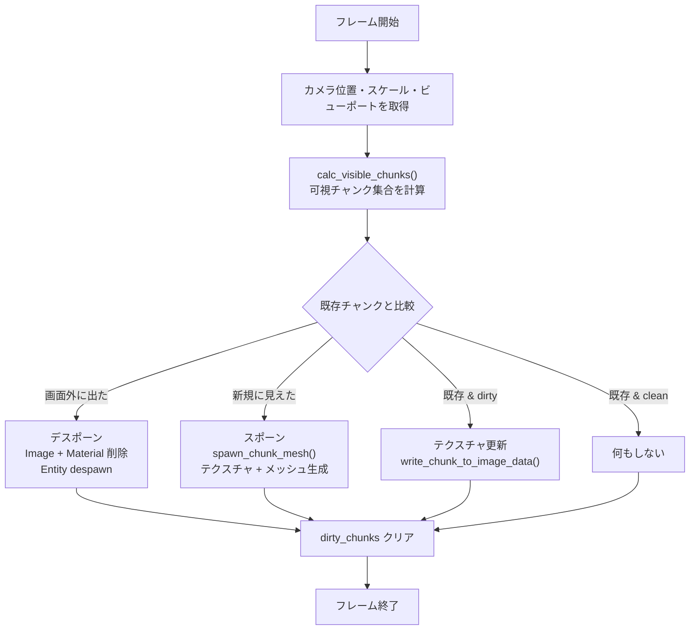
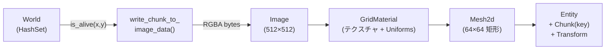

# 無限ワールド描画アーキテクチャ

Conway's Game of Life を **境界のない無限フィールド** で効率的に描画するための設計を解説する。

## 全体像

```
┌──────────────────────────────────────────────────────────────────┐
│                        画面に表示される範囲                        │
│  ┌──────────┬──────────┬──────────┐                              │
│  │ Chunk    │ Chunk    │ Chunk    │  ← カメラに映るチャンクだけ     │
│  │ (-1, 0)  │ (0, 0)   │ (1, 0)   │    動的にスポーン/デスポーン   │
│  ├──────────┼──────────┼──────────┤                              │
│  │ Chunk    │ Chunk    │ Chunk    │                              │
│  │ (-1, 1)  │ (0, 1)   │ (1, 1)   │                              │
│  └──────────┴──────────┴──────────┘                              │
│                                                                  │
│  画面外のチャンクはメモリから解放される                              │
│  セルデータ自体は World (HashSet) に永続保存                       │
└──────────────────────────────────────────────────────────────────┘
```

3つの核心アイデア：

1. **スパースストレージ** — 生存セルだけを `FxHashSet<(i32, i32)>` で保持。死亡セルは保存しない
2. **チャンクレンダリング** — 64×64 セルを1チャンクとし、各チャンクを個別のテクスチャ付きメッシュで描画
3. **動的管理** — カメラに映るチャンクだけをスポーンし、画面外に出たらデスポーン

---

## 1. データ構造 — World リソース

`game-plugin/src/resources/world.rs`

```rust
pub struct World {
    cells: FxHashSet<(i32, i32)>,        // 生存セルの座標集合
    initial_cells: FxHashSet<(i32, i32)>, // リセット用の初期パターン
    dirty_chunks: FxHashSet<ChunkKey>,    // 変更があったチャンク群
    pub generation_count: u64,            // 現在の世代数
}
```

```
               World リソース
┌────────────────────────────────────────┐
│                                        │
│  cells (FxHashSet)                     │
│  ┌─────────────────────────────────┐   │
│  │ (0, 0)  (1, 0)  (2, 1)  ...    │   │ ← 生存セルの座標だけ
│  │ (-5, 3) (100, -42)  ...        │   │    i32 なので事実上無限
│  └─────────────────────────────────┘   │
│                                        │
│  dirty_chunks (FxHashSet)              │
│  ┌─────────────────────────────────┐   │
│  │ (0, 0)  (1, 0)  (-1, 0)  ...   │   │ ← 再描画が必要なチャンク
│  └─────────────────────────────────┘   │
│                                        │
└────────────────────────────────────────┘
```

**なぜ HashSet？**

- 固定サイズ配列 (`Vec<bool>`) では無限フィールドを表現できない
- HashSet なら生存セルだけを保持するため、広大な空間でもメモリ効率が高い
- `FxHashSet` は Rust の標準 `HashSet` より高速なハッシュ関数を使用

---

## 2. 座標系統 — 4層のマッピング

セルの位置情報は4つの座標系を経由して最終的にピクセルになる。

```
┌─────────────────────────────────────────────────────────────┐
│  ① セル座標 (i32, i32)                                      │
│     ゲームロジック上のセル位置                                  │
│     例: (0, 0), (63, 63), (-5, 100)                         │
│                                                             │
│         ↓  div_euclid(64)                                   │
│                                                             │
│  ② チャンク座標 (ChunkKey = (i32, i32))                     │
│     64×64 セルを1チャンクとしてグループ化                      │
│     例: セル (0,0)〜(63,63) → チャンク (0,0)                │
│         セル (64,0)〜(127,63) → チャンク (1,0)              │
│         セル (-1,0)          → チャンク (-1,0)              │
│                                                             │
│         ↓  × CELL_WORLD_SIZE (= 1.0)                       │
│                                                             │
│  ③ ワールド座標 (f32, f32)                                   │
│     Bevy の 2D 空間上の位置。Y軸は反転                        │
│     チャンク(0,0) の中心 = (32.0, -32.0)                    │
│                                                             │
│         ↓  × CELL_PIXELS (= 8)                              │
│                                                             │
│  ④ テクスチャ座標 (u32, u32)                                 │
│     512×512 ピクセルの RGBA テクスチャ                        │
│     1セル = 8×8 ピクセルの色ブロック                           │
└─────────────────────────────────────────────────────────────┘
```

### 具体例

```
セル (65, 3) の場合:

  チャンクキー = (65 / 64, 3 / 64) = (1, 0)
  チャンク内位置 = (65 % 64, 3 % 64) = (1, 3)
  テクスチャ座標 = (1 * 8, 3 * 8) = (8, 24) ← 8×8 ピクセルブロックの左上

セル (-1, 0) の場合:                     ← 負の座標も正しく処理
  チャンクキー = (-1).div_euclid(64) = -1  → (-1, 0)
  チャンク内位置 = (-1).rem_euclid(64) = 63  → (63, 0)
```

### Y軸反転

```
     カメラ (Bevy)        ゲームグリッド
          Y+                  Y+
          ↑                   ↓
          │                   │
    ──────┼──── X+      ──────┼──── X+
          │                   │

  ワールド座標の Y = -(グリッド Y)
```

`chunk_world_pos()` と `screen_to_grid_coords()` でこの変換を吸収している。

---

## 3. チャンク管理サイクル

`game-plugin/src/systems/chunk.rs` の `manage_chunks()` が毎フレーム実行される。



### 可視チャンクの計算

```
    カメラが見ている範囲（ワールド座標）
    ┌─────────────────────────────────────┐
    │         ビューポート                  │
    │   half_w = viewport_w × scale / 2   │
    │   half_h = viewport_h × scale / 2   │
    │                                     │
    │        ┌─ camera_pos ─┐             │
    │        │    (x, y)    │             │
    │        └──────────────┘             │
    │                                     │
    │   min_x ◄──────────────► max_x      │
    │   min_y ◄──────────────► max_y      │
    └─────────────────────────────────────┘
              ↓
    チャンク座標に変換（±1 マージン）
    ┌───┬───┬───┬───┬───┐
    │   │   │   │   │   │ ← マージン分の余裕で
    ├───┼───┼───┼───┼───┤   スクロール時のポップイン防止
    │   │ ■ │ ■ │ ■ │   │
    ├───┼───┼───┼───┼───┤
    │   │ ■ │ ■ │ ■ │   │
    ├───┼───┼───┼───┼───┤
    │   │   │   │   │   │
    └───┴───┴───┴───┴───┘
          ■ = 実際に見えるチャンク
```

---

## 4. テクスチャ生成

`game-plugin/src/rendering.rs`

各チャンクは **512×512 ピクセルの RGBA テクスチャ** を持つ。

```
1チャンク = 64×64 セル
1セル = 8×8 ピクセル
→ 64 × 8 = 512 ピクセル四方

    テクスチャ (512 × 512 px)
    ┌────────────────────────────────────────┐
    │ ████████ ████████ ████████ ....        │
    │ ████████ ████████ ████████             │
    │ ████████ ████████ ████████             │  各 8×8 ブロックが
    │ ████████ ████████ ████████             │  1セルに対応
    │                                        │
    │ ████████ ████████ ████████             │  ■ = 生存セル (0, 217, 115)
    │ ████████ ████████ ████████             │  □ = 死亡セル (15, 15, 20)
    │ ████████ ████████ ████████             │
    │ ████████ ████████ ████████             │
    │          ...                           │
    └────────────────────────────────────────┘
```

### スポーン時の処理フロー



### Dirty チャンクの追跡

セルの変更があるたびに、影響を受けるチャンクが `dirty_chunks` に記録される。

```
  toggle_cell(65, 3)  →  dirty_chunks に (1, 0) を追加
  progress_generation()  →  変化したセルのチャンクを全て追加
  reset() / clear()  →  影響範囲のチャンクを追加

  manage_chunks() で dirty なチャンクのテクスチャだけを再生成
  → 全チャンク再描画を回避してパフォーマンス向上
```

---

## 5. グリッド線シェーダー

`assets/shaders/grid_material.wgsl`

グリッド線はテクスチャに描き込まず、**GPU シェーダーでリアルタイム計算** する。

### なぜシェーダーで描画？

- テクスチャに線を焼き込むとズーム時に線の太さが変わってしまう
- シェーダーなら **常に1ピクセル幅** のグリッド線を描画できる

### 描画アルゴリズム

```
  ステップ1: UV → セル座標に変換
  ┌──────────────────────────┐
  │ UV (0.0 〜 1.0)          │
  │    × chunk_cells (64)    │
  │    = cell_coord (0 〜 64) │
  └──────────────────────────┘

  ステップ2: セル境界までの距離を計算
  ┌──────────────────────────┐
  │ fract(cell_coord)        │
  │    0.0 ────── 0.5 ────── 1.0
  │    境界       中央       境界
  │                          │
  │ dist_to_edge = min(fract, 1-fract)
  │    0.0 ────── 0.5 ────── 0.0
  │    境界       中央       境界
  └──────────────────────────┘

  ステップ3: fwidth() でピクセルサイズを取得
  ┌──────────────────────────────────┐
  │ fwidth(cell_coord)               │
  │ = 隣接ピクセル間の cell_coord 差  │
  │ = 1スクリーンピクセルがセル空間で  │
  │   何単位分に相当するか            │
  │                                  │
  │ ズームイン時:  fw ≈ 小さい値      │
  │ ズームアウト時: fw ≈ 大きい値     │
  └──────────────────────────────────┘

  ステップ4: smoothstep でアンチエイリアシング
  ┌──────────────────────────────────┐
  │ smoothstep(fw, 0.0, dist)        │
  │                                  │
  │ dist < 0    → 1.0 (グリッド線)   │
  │ 0 < dist < fw → 滑らかに遷移     │
  │ dist > fw   → 0.0 (セル色)       │
  │                                  │
  │ → AA幅がちょうど1ピクセル分       │
  └──────────────────────────────────┘

  ステップ5: フェードアウト（ズームアウト時）
  ┌──────────────────────────────────┐
  │ cell_screen_pixels = 1 / fw      │
  │                                  │
  │ < 2px → グリッド線を完全に非表示  │
  │ 2〜6px → 徐々にフェードイン       │
  │ > 6px → 通常表示                 │
  │                                  │
  │ → セルが小さすぎる時に線が         │
  │   潰れて汚くなるのを防止          │
  └──────────────────────────────────┘
```

### 最終合成

```
  最終色 = mix(セル色, グリッド線色, grid_factor × intensity × fade)

  grid_factor: 0.0（セル中央）〜 1.0（境界上）
  intensity:   GRID_LINE_SCREEN_WIDTH (= 0.1) で薄い線に
  fade:        ズームアウト時の自動フェード
```

---

## 6. エンティティ構成

```
  WorldCamera (Orthographic)
  │
  │  ビューポート: 画面の上部 (高さ - 80px)
  │
  └─► Chunk Entity × N個（動的）
       ├── Mesh2d (64×64 ワールド単位の矩形)
       ├── MeshMaterial2d<GridMaterial>
       │    ├── cell_texture: Handle<Image>  ← 512×512 RGBA
       │    └── uniforms: GridUniforms       ← カメラスケール等
       ├── Transform (チャンク中心座標)
       ├── Chunk(chunk_key)  ← マーカーコンポーネント
       └── Layer::World

  BottomPanelCamera (UI)
  │
  │  ビューポート: 画面の下部 80px
  │
  └─► UI ボタン群
```

---

## 7. パフォーマンス最適化まとめ

| 最適化 | 効果 | 場所 |
|--------|------|------|
| **スパースセル保存** | 死亡セルを保存しない → メモリ O(生存セル数) | `World: FxHashSet` |
| **Dirty tracking** | 変更チャンクのみテクスチャ再生成 | `dirty_chunks` |
| **動的チャンク管理** | 画面内のチャンクだけ存在 | `manage_chunks()` |
| **FxHash** | 整数キーに特化した高速ハッシュ | `rustc_hash::FxHashSet` |
| **効率的シミュレーション** | 生存セル + 8近傍のみ処理 | `progress_generation()` |
| **GPU グリッド線** | 線の描画をシェーダーに委譲 | `grid_material.wgsl` |
| **マージン付き可視範囲** | スクロール時のポップイン防止 | `calc_visible_chunks()` ±1 |
| **明示的アセット解放** | デスポーン時に Image/Material を remove | `manage_chunks()` |

---

## 8. 主要定数

`common/src/consts.rs`

| 定数 | 値 | 意味 |
|------|-----|------|
| `CHUNK_SIZE` | 64 | 1チャンクの1辺のセル数 |
| `CELL_WORLD_SIZE` | 1.0 | 1セルのワールド空間サイズ |
| `CHUNK_WORLD_SIZE` | 64.0 | 1チャンクのワールド空間サイズ |
| `CELL_PIXELS` | 8 | 1セルのテクスチャピクセル数 |
| `CHUNK_TEX_SIZE` | 512 | 1チャンクのテクスチャサイズ (64×8) |
| `GRID_LINE_SCREEN_WIDTH` | 0.1 | グリッド線の描画強度 |
| `CELL_ALIVE_RGB` | (0, 217, 115) | 生存セルの色 |
| `CELL_DEAD_RGB` | (15, 15, 20) | 死亡セルの色 |
| `GRID_LINE_RGB` | (25, 26, 32) | グリッド線の色 |

---

## 9. ファイルマップ

```
game-plugin/src/
├── resources/
│   └── world.rs              ← World リソース、セル管理、dirty_chunks
├── components/
│   └── chunk.rs              ← Chunk マーカーコンポーネント
├── systems/
│   ├── chunk.rs              ← calc_visible_chunks(), manage_chunks()
│   ├── coordinate.rs         ← ワールド座標 ↔ グリッド座標 変換
│   └── input.rs              ← ズーム・パン操作
├── rendering.rs              ← spawn_chunk_mesh(), write_chunk_to_image_data()
└── grid_material.rs          ← GridMaterial, GridUniforms 定義

common/src/
└── consts.rs                 ← 全定数

assets/shaders/
└── grid_material.wgsl        ← グリッド線シェーダー
```
